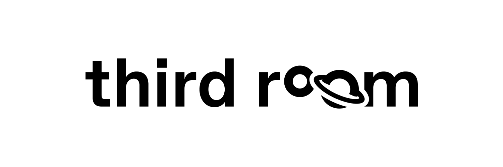

<div align="center">
  
  <br/>
  <br/>
</div>

[](https://matrix.to/#/#thirdroom-dev:matrix.org)

Third Room is a platform for shared virtual worlds built on top of [Matrix](https://matrix.org). Third Room aims to
make it easy to discover, create, and share 3D worlds with others.

## Getting Started

Visit [thirdroom.io](https://thirdroom.io)

## Homeserver Requirements

Your homeserver should be on [Synapse version 1.62 or higher](https://github.com/matrix-org/synapse/releases). This is due to Third Room's requirement of the `Cross-Origin-Resource-Policy: cross-origin` header for the media repository's download route. Third Room uses SharedArrayBuffers which require us to [run in a secure-context](https://developer.mozilla.org/en-US/docs/Web/JavaScript/Reference/Global_Objects/SharedArrayBuffer#security_requirements).

You also should have a TURN server set up with your homeserver. More info on how to do that [here](https://matrix-org.github.io/synapse/develop/turn-howto.html).

## About Third Room

Third Room enables people to discover and create virtual worlds while protecting their privacy and giving them ownership over their data. We use open standards to ensure that both the 3d content and social networking data is portable and interoperable with other platforms. We empower creators to design and program rich and interactive virtual worlds and avatars using a wide variety of 3D content creation tools and harnessing the power of the glTF file format.

The Third Room client developed in this repository is only one implementation of a possible Third Room client and we welcome additional web or native clients to implement the protocols we design together. Third Room itself is designed around the Matrix protocol, but pieces of this project can be utilized in other 3D web applications including other virtual world platforms. We intend to build the client in a modular fashion, improving the overall landscape for the 3D web ecosystem and being a good participant in the open source community that we are benefitting from.

We will be a good participant in the immersive web. Third Room is just one piece of the overall immersive web. We believe platforms that intend to create their own "metaverse" are missing the point of that term. There is only one metaverse just as there is only one internet. We will embrace and encourage interoperability instead of accepting fragmentation.

Third Room at its core is focused on creating spaces for people and communities to feel safe. We will foster an open community that is kind, respectful, and accepting of others. We will utilize Matrix's existing moderation tools and extend them to best protect our community members against trolls and harassment. We will put users in control of their own privacy and always design with a privacy and safety first mindset.

## Problems

- Virtual worlds are disconnected which makes multiplayer gaming and switching activities or applications difficult and clunky.
- Some virtual world platforms are monetized with an ad based model that uses sensitive user data to recommend ads.
- Other virtual world platforms are monetized via NFTs which can be inaccessible due to cryptocurrency transaction fees, some are built on proof of work chains that require vast amounts of electricity, and all operate on the concept of artificial scarcity which has been co-opted by many groups in various speculative schemes.
- There is high demand from audiences for free user-generated content games on platforms where creators make next to nothing. The audiences and creators for these platforms heavily skew younger and are being exploited by platform operators.
- The quality of these user-generated games can be high but most are not due to the platform restrictions especially around monetization opportunities. Creators cannot afford to create indie/AAA content.

## The Pitch

- Third Room will be built on top of the Matrix protocol allowing for decentralized hosting of virtual worlds.
- Worlds can be traversed quickly by changing rooms.
- Your identity, network, and other shared data will be brought with you between these worlds.
- Worlds will have spatial voice chat and game networking that can be made end-to-end encrypted so that you know you are only sending data to the people in the room.
- Creators of all skill levels will be able to create worlds using either a beginner-friendly in-world collaborative tool or industry-standard 3D tools.
- Creators will be able to use the programming language of their choice compiled to WebAssembly to add interactivity to their worlds.
- Creators will also be able to monetize their worlds through marketplaces for 3D content including avatars, environments, and props as well as scripts. They also can monetize room or server membership.

### Matrix

Third Room is built on top of the Matrix group VoIP spec
([MSC3401](https://github.com/matrix-org/matrix-spec-proposals/blob/matthew/group-voip/proposals/3401-group-voip.md))
where WebRTC connections for voice and game networking are established over Matrix. Matrix is also used for hosting
the 3D assets for these virtual worlds and your avatars as well as providing decentralized identity, end to end
encryption, text chat, room permissions, and more. We've also started work on a Matrix spec for virtual worlds
([MSC3815](https://github.com/matrix-org/matrix-spec-proposals/pull/3815)).

### Open Source / License

Third Room is completely open source under the [Apache 2.0 license](./LICENSE). You can check out this repository, fork
it, and modify it as you please. The project is governed by the Matrix.org Foundation and all our work is done in the
open. We're still getting the foundation of the project set up and don't have a streamlined flow of taking on external
contributors right now. If you are interested in helping out you can join us in the
[#thirdroom-dev:matrix.org](https://matrix.to/#/%23thirdroom-dev:matrix.org) Matrix room.

## Manifold Engine

Manifold, Third Room's engine, lives under the [/src/engine](./src/engine/) directory of this project. It is developed
with the bitECS and Three.js libraries. It is eventually intended to be published as a standalone project for use with
or without Matrix, but it is currently under active development and not ready for a public release yet.

### Entity Component System (ECS)

Manifold is built with [bitECS](https://github.com/NateTheGreatt/bitECS), a high performance ECS library written in
JavaScript. bitECS is built around [Data Oriented Design](https://www.dataorienteddesign.com/dodbook/) and JavaScript's
TypedArrays to improve CPU cache performance.

In addition to performance, ECS design lets us have predictable execution of systems and more easily debug issues that
arise in our game loop.

We've also adopted bitECS's function programming patterns throughout our engine for simpler abstractions, better tree
shaking, and faster design iteration.

### Multithreading

Manifold is designed around a multithreaded architecture which allows us to fully utilize your system's hardware. As a
result, the core of the engine is split across these different threads. We have carefully built out lock-free scene
graph data structures backed by JavaScript's
[SharedArrayBuffers](https://developer.mozilla.org/en-US/docs/Web/JavaScript/Reference/Global_Objects/SharedArrayBuffer)
and [Atomics](https://developer.mozilla.org/en-US/docs/Web/JavaScript/Reference/Global_Objects/Atomics). This allows us
to split the renderer from the game thread and run each at different rates. With high refresh rate monitors becoming
the norm, this is becoming increasingly important. You can now get smooth 120hz+ rendering while your game logic runs
at a stable 60hz. Allowing for the renderer thread to submit draw calls as soon as possible in the frame and keep the
GPU saturated while your game logic gets a full 16ms to run complex physics simulations and more. The render thread
then uses interpolation to smoothly animate the transforms of objects in your scene.

Another short term option we are considering for reducing input latency is with a locking double buffered approach.
Where the game simulation is ran at the same rate as your monitor's refresh rate. This approach has the game thread
computing the state of the next frame and the render thread rendering the last frame's state. It requires the game
simulation to complete within the time frame of your monitor's refresh rate or you will drop frames which may not be
preferable when you are bound by your game's simulation. However, if your simulation is simple, this can be a good
option for reducing input latency. It's also possible that we may be able to switch between these two approaches
depending on the average execution time of your game thread on your particular device.

Browser limitations and API adoption of things like [OffscreenCanvas](https://developer.mozilla.org/en-US/docs/Web/API/OffscreenCanvas)
and [Atomics.waitAsync](https://developer.mozilla.org/en-US/docs/Web/JavaScript/Reference/Global_Objects/Atomics/waitAsync)
create design constraints that are fairly unique to the Web. Our current architecture lets us stay flexible and adapt
to advancements in browser technology.

### Rendering

Manifold uses Three.js as its rendering library. However, the Three.js API is not intended to be used directly by Third
Room developers. We've built a multi-threaded scene graph API with a similar shape to the
[glTF](https://www.khronos.org/registry/glTF/specs/2.0/glTF-2.0.html) data model. Our intention is for glTF content to
be loaded on the game thread, passed to the render thread via the
[MessageChannel](https://developer.mozilla.org/en-US/docs/Web/API/MessageChannel) `postMessage` API, and then
modifications to transforms or materials can be made synchronously on the game thread with data structures backed by
SharedArrayBuffers. These rendering changes will be applied on the next render frame.

The renderer itself currently exists on either a dedicated WebWorker when OffscreenCanvas is available, or it shares
the main browser thread when it's not.

Three.js is built around the WebGL API and recently switched over to WebGL2 as the default. There is also early support
for the WebGPU support. We're currently focusing on the WebGL2 target as browser support is very good now and we can
get some performance improvements over WebGL1 with features like Uniform Buffer Objects and Vertex Array Objects.

Most of our rendering features will be tied to the glTF
[specification](https://www.khronos.org/registry/glTF/specs/2.0/glTF-2.0.html) and
[extensions](https://github.com/KhronosGroup/glTF/tree/main/extensions).

Currently supported:

- [KHR_materials_unlit](https://github.com/KhronosGroup/glTF/blob/main/extensions/2.0/Khronos/KHR_materials_unlit/README.md)
- [EXT_mesh_gpu_instancing](https://github.com/KhronosGroup/glTF/blob/main/extensions/2.0/Vendor/EXT_mesh_gpu_instancing/README.md)
- [KHR_lights_punctual](https://github.com/KhronosGroup/glTF/blob/main/extensions/2.0/Khronos/KHR_lights_punctual/README.md)
- [KHR_texture_transform](https://github.com/KhronosGroup/glTF/blob/main/extensions/2.0/Khronos/KHR_texture_transform/README.md)
- [KHR_materials_emissive_strength](https://github.com/KhronosGroup/glTF/blob/c58e7e57184a4024dd1877dd9d219b198d6e0006/extensions/2.0/Khronos/KHR_materials_emissive_strength/README.md)
- [KHR_materials_ior](https://github.com/KhronosGroup/glTF/blob/main/extensions/2.0/Khronos/KHR_materials_ior/README.md)
- [KHR_materials_transmission](https://github.com/KhronosGroup/glTF/blob/main/extensions/2.0/Khronos/KHR_materials_transmission/README.md)
- [KHR_materials_volume](https://github.com/KhronosGroup/glTF/blob/main/extensions/2.0/Khronos/KHR_materials_volume/README.md)
- [KHR_texture_basisu](https://github.com/KhronosGroup/glTF/blob/main/extensions/2.0/Khronos/KHR_texture_basisu/README.md)

To Do:

- [KHR_draco_mesh_compression](https://github.com/KhronosGroup/glTF/blob/main/extensions/2.0/Khronos/KHR_draco_mesh_compression/README.md)
- [KHR_materials_clearcoat](https://github.com/KhronosGroup/glTF/blob/main/extensions/2.0/Khronos/KHR_materials_clearcoat/README.md)
- [KHR_materials_sheen](https://github.com/KhronosGroup/glTF/blob/main/extensions/2.0/Khronos/KHR_materials_sheen/README.md)
- [KHR_materials_specular](https://github.com/KhronosGroup/glTF/blob/main/extensions/2.0/Khronos/KHR_materials_specular/README.md)
- [KHR_mesh_quantization](https://github.com/KhronosGroup/glTF/blob/main/extensions/2.0/Khronos/KHR_mesh_quantization/README.md)
- [EXT_meshopt_compression](https://github.com/KhronosGroup/glTF/blob/main/extensions/2.0/Vendor/EXT_meshopt_compression/README.md)
- [EXT_texture_webp](https://github.com/KhronosGroup/glTF/blob/main/extensions/2.0/Vendor/EXT_texture_webp/README.md)
- [KHR_materials_iridescence](https://github.com/KhronosGroup/glTF/blob/1ad76e411dbb4892cda68806b038b4b7c9ecfcd7/extensions/2.0/Khronos/KHR_materials_iridescence/README.md)
- [KHR_materials_anisotropy](https://github.com/KhronosGroup/glTF/blob/f7bda8718ad8b079f9cc53d94685ab67a5e48b0c/extensions/2.0/Khronos/KHR_materials_anisotropy/README.md)
- [KHR_materials_diffuse_transmission](https://github.com/KhronosGroup/glTF/blob/5c66d6cb639708fdbedb632264b239e08be3bbcd/extensions/2.0/Khronos/KHR_materials_diffuse_transmission/README.md)
- [KHR_materials_sss](https://github.com/KhronosGroup/glTF/blob/5784a1edc85ad3323dc0ff1fa42ad49525d3f598/extensions/2.0/Khronos/KHR_materials_sss/README.md)
- [MOZ_lightmap](https://github.com/takahirox/MOZ_lightmap)
- [EXT_texture_video](https://github.com/takahirox/EXT_texture_video)
- [KHR_lights_shadows](https://github.com/takahirox/KHR_lights_shadows)

Instead of the Three.js GLTFLoader, we've implemented our own glTF loader that works with our multithreaded
architecture. However, the renderer is still using Three.js. This means as Three.js improves support for glTF
rendering features we hope to add support as well. We may also be able to push support for certain glTF material
features faster than Three.js in our own loader.

Aside for glTF material features, we hope to add support for various postprocessing effects such as motion blur, depth
of field, bloom, and more.

For rendering performance we hope to make full use of Three's instanced mesh rendering, light maps, and light probes.
We'll also be looking into cascaded shadow maps, reflection probes, and more.

### Physics

Manifold uses [Rapier.js](https://www.rapier.rs/docs/user_guides/javascript/getting_started_js) for physics which is a
WebAssembly port of the Rapier Rust physics engine. It's a fast and relatively light library with well-documented APIs
and active development. We run our physics system on the game thread for synchronous access to the physics world.

We're helping standardize embedding of physics data in glTF in the
[Open Metaverse Interoperability Group](https://omigroup.org/) with the following extensions:

- [OMI_collider](https://github.com/omigroup/gltf-extensions/blob/b14522f7b000cfc9d2c0fc4fc9de38af68d0394e/extensions/2.0/OMI_collider/README.md)
- [OMI_physics_body](https://github.com/omigroup/gltf-extensions/blob/3f5a9f3bfd3117d8a201b20d48acb7f02244edff/extensions/2.0/OMI_physics_body/README.md)

### Audio

Manifold uses the WebAudio API for spatialized audio from other users and environmental audio. We're still
investigating how we might best use features such as [AudioWorklet](https://developer.mozilla.org/en-US/docs/Web/API/AudioWorklet)
and third party libraries such as [Oddio](https://github.com/Ralith/oddio).

### Networking

Manifold uses WebRTC DataChannels for game networking. Third Room establishes these DataChannels via Matrix
([MSC3401](https://github.com/matrix-org/matrix-spec-proposals/blob/matthew/group-voip/proposals/3401-group-voip.md)),
however Manifold has an interface to connect your own network interface. Currently we are working with ordered and
reliable DataChannels, but we intend to utilize unreliable DataChannels for fast changing data like transforms.

We also intend to document our network protocol and hopefully standardize it as part of our virtual world Matrix spec
([MSC3815](https://github.com/matrix-org/matrix-spec-proposals/pull/3815)). We've documented some of our progress so
far in our [network protocol document](./docs/network-protocol.md).

Currently our networking is peer-to-peer, however work is underway on a selective forwarding unit (SFU) and sfu-to-sfu
protocol that will increase world capacity by lowering outbound bandwidth and interest management algorithms. Our start
on this project can be seen in the [sfu-to-sfu](https://github.com/matrix-org/sfu-to-sfu) repository.

WebRTC is a fantastic technology, however it's also a very complex and fragile one. The new
[WebTransport](https://www.w3.org/TR/webtransport/) API looks like it may be a possible alternative when communicating
through a SFU. We're interested in exploring this area further in the future.

### WebXR

Manifold currently doesn't have WebXR support. However, we plan to start work on it as soon as we have a feature
complete product running on desktops. Our multithreading support will work a little differently when WebXR is involved
due to the need for the lowest possible input latency to avoid motion sickness. We're still investigating this area and
we'll have more to share as we get closer to starting this work.

### Editor

The Manifold Editor will be built into the game engine and will be able to be launched at any time while in a scene.
It is being designed from the start for collaborative world building. The editor will make use of glTF as both its
authoring and runtime format. glTF was designed as a transmission format for real-time graphics, not an authoring
format for DCC tools like Blender or Maya. However, we believe there is a middle ground where glTF can be the
foundation for a format that enables composition of assets similar to how HTML allows you to embed images, video,
iframes, and more.

### User Generated Content and Sandboxed Scripting

Third Room worlds and avatars are owned by their creators. Worlds and avatars are published as glTF files hosted on the
Matrix network or elsewhere. Creators will also be able to embed WebAssembly scripts inside their glTF content,
enabling custom behaviors. Manifold's APIs are built around the ability to safely provide performant manipulation of a
glTF scene graph from a WebAssembly module. This enables us to run partially untrusted scripts safely in your
Third Room client as you navigate from world to world.

We hope to standardize this WebAssembly Scene Graph API as a member of the Open Metaverse Interoperability Group's
[Scripting Working Group](https://github.com/omigroup/omi-scripting-group).

**UPDATE:** There is a very early version of the Web Scene Graph API supported today. You can find more info about it in the [WebSG Docs](./docs/web-scene-graph-api.md).

## Creating Your Own Scenes

Third Room is built on top of the glTF standard 3D file format, you can technically use any tool that exports glTF to create Third Room scenes. However, not all of the glTF extensions Third Room uses are supported by every tool. We've created the Third Room Unity Exporter for easily creating Third Room scenes from Unity.

Learn more [here](https://github.com/matrix-org/thirdroom-unity-exporter).

## Local Development

The Third Room client can be ran locally against any Matrix homeserver in development.

After you've installed node.js locally, run the following commands.

```
npm install -g yarn
yarn
yarn dev
```

**NOTE: Vite does not transpile import statements in web workers and Chromium based browsers are the only browsers to support imports in Web Workers. In order to develop in non-chromium browsers, run the following command which will build the project after every change.**

```
yarn preview
```

Open http://localhost:3000

## Deployment

The Third Room client can be deployed to any static web host with the ability for wildcard routing for single page web
apps and adding HTTP headers.

We currently deploy Third Room to Netlify via a custom GitHub actions deploy script. If you fork our repository and
set the `NETLIFY_AUTH_TOKEN` and `NETLIFY_SITE_ID` secrets in your GitHub configuration, this setup should work for you
as well. Every PR will be built and deployed as a preview deploy and every commit / merge to `main` will be deployed to
your Netlify site.

When deploying to thirdroom.io, the [testing procedure](./docs/testing-procedure.md) should be completed before deploying.

To setup OIDC login client configs needs to be added in `config.json`. Client configs includes `client_id` and `uris` issued by OIDC Provider.
