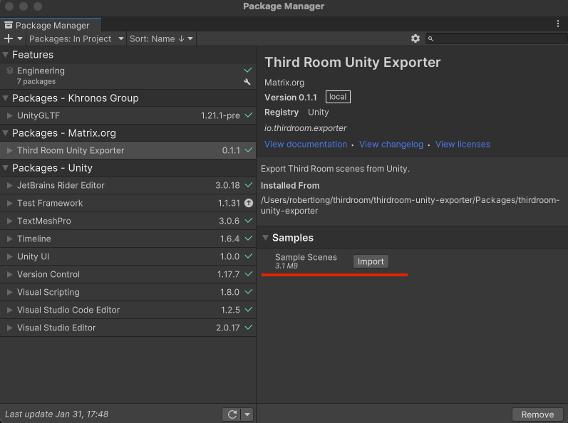
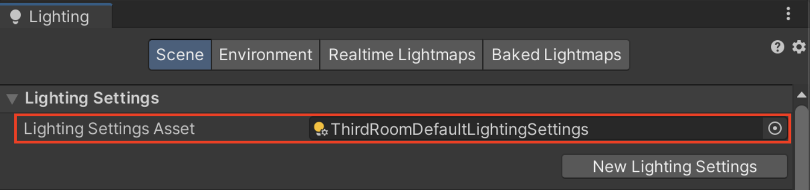
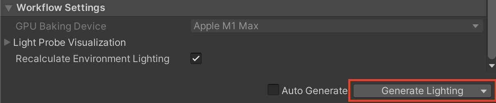
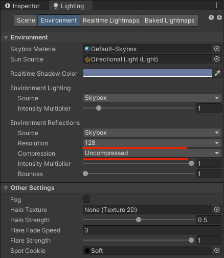
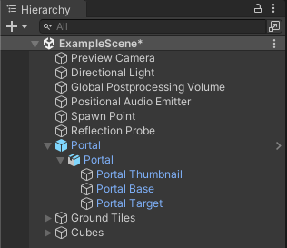
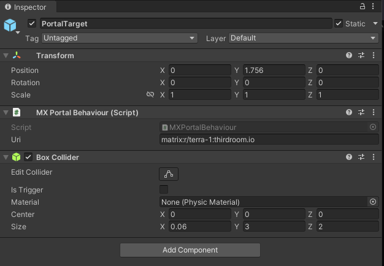
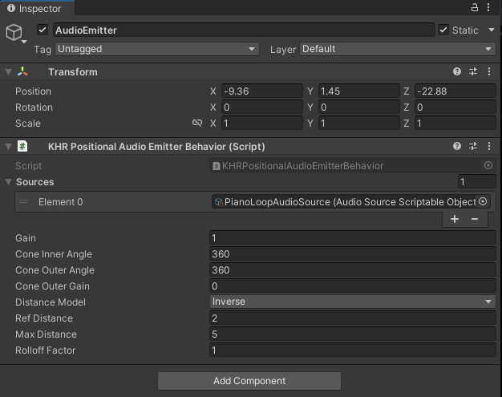
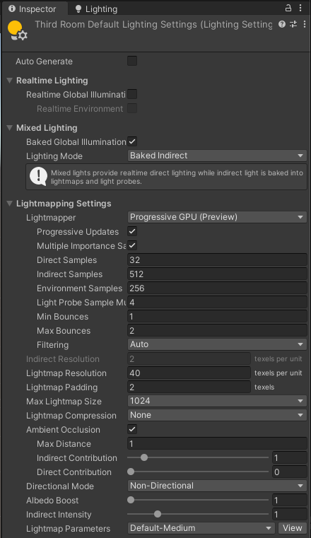
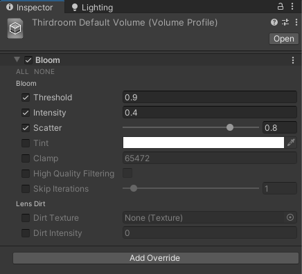

# Third Room Unity Exporter

Export Third Room scenes from Unity. Powered by UnityGLTF.

## Contents

- [Installation](#installation)
- [Scene Setup](#scene-setup)
- [Spawn Points](#spawn-points)
- [Portals](#portals)
- [Colliders](#colliders)
- [Skybox](#skybox)
- [Audio](#audio)
- [Lights and Lightmaps](#lights-and-lightmaps)
- [Reflection Probes](#reflection-probes)
- [Optimization and Uploading](#optimization-and-uploading)
- [Getting Help](#getting-help)

## Installation

First you'll need a copy of Unity which can be downloaded [here](https://unity.com/download).

Internally we use Unity 2021.3.17f1 (LTS), Unity versions 2020.3+ should be supported, but we can't make any promises. 2021.3+ would be preferred.

You should use the Universal Render Pipeline (URP) to maximize compatibility with UnityGLTF.

::: warning
If you are a macOS user and see this error when trying to import packages via git URL:

```
  xcrun: error: invalid active developer path (/Library/Developer/CommandLineTools), missing xcrun at: /Library/Developer/CommandLineTools/usr/bin/xcrun
```

Run `xcode-select --install` in order for git import of packages to function properly.
:::

This package depends on a branch of UnityGLTF that needs to be installed before you install the exporter.

1. Open `Window > Package Manager`
2. In Package Manager, click <kbd>+</kbd> and select <kbd>Add Package from git URL</kbd>
3. Paste `https://github.com/matrix-org/UnityGLTF.git?path=/UnityGLTF/Assets/UnityGLTF#thirdroom/dev`
4. Click <kbd>Add</kbd>.

After that is installed you can do the same thing for the Third Room Exporter:

1. In Package Manager, click <kbd>+</kbd> and select <kbd>Add Package from git URL</kbd>
2. Paste `https://github.com/matrix-org/thirdroom-unity-exporter.git?path=/Packages/thirdroom-unity-exporter`
3. Click <kbd>Add</kbd>.

You'll also probably want to add the Sample Scenes which contains an example scene, a portal asset, and default settings assets for you to use in your project.

Install the sample scenes in the Package Manager by pressing <kbd>Import</kbd> under the Samples dropdown.



## Scene Setup

Whether you're working with an existing scene or starting one from scratch there's a few things you'll want to check before you get started.

### Project Settings

1. Open `Edit > Project Settings...`
2. Ensure that <kbd>Color Space</kbd> is set to `Linear`
3. Ensure that <kbd>Lightmap Encoding</kbd> is set to `Normal Quality`
4. If you're using Unity 2022, ensure that <kbd>HDR Cubemap Encoding</kbd> is set to `Normal Quality`


If these settings aren't set, your lighting may look fine in Unity, but it'll look off when exporting and importing into Third Room.

### Render Pipeline Settings

You can find your render pipeline assets in your project's `Settings` directory. New projects are typically set up to use the High Fidelity render pipeline while in the editor.
Open up the asset and ensure that HDR is turned on. It should be already.


### Lighting Settings

You will need to setup Lighting Settings properly in order to export as glTF from Unity3D.

1. Open `Window > Rendering > Lighting`
1. Select `ThirdRoomDefaultLightingSettings` as the Lighting Settings Asset
1. At the botton of the Lighting panel, make sure to click the `Generate Lighting` button before exporting as glTF




### Materials

We find that the `UnityGLTF/PBRGraph` material works best for exported scenes. You can convert to `UnityGLTF/PBRGraph` material from the following shaders with automatic conversions:

- `Standard`
- `URP/Lit`
- `URP/Unlit`

To do so change the shader on the selected material to `UnityGLTF/PBRGraph`.

For all new materials, set the `UnityGLTF/PBRGraph` shader before you start setting properties.

Note that Third Room does not yet have support for the following extensions:

- KHR_matrials_irridescence
- KHR_materials_specular
- KHR_materials_clearcoat

Upon import those extensions will be ignored. We hope to support them in the future.

More information on UnityGLTF's materials can be found [here](https://github.com/prefrontalcortex/UnityGLTF/tree/dev#gltf-materials).

## Exporting a Scene

Once you have a scene ready to be exported to Third Room follow these steps to export it and test it out:

1. Click `Assets > UnityGLTF > Export active scene as glTF`
2. Pick an output directory
3. Open https://thirdroom.io/viewer in your browser.
4. Drag and drop the entire contents of the output directory into the viewer.

You should see your output scene in the viewer. If you haven't placed a spawn point yet you'll be flying around the space. It may also be lit incorrectly and be very expensive to render. In the following sections we'll go over all of the supported features of the Third Room Unity Exporter.

## Camera

If one or more camera is included in your exported scene, the first camera will be used as the "preview camera" that is shown when you've loaded an environment, but not yet entered the world.

A quick and easy way to position this camera is:

1. Move your viewport to the position and orientation you'd like to set.
2. Select your camera
3. Click `GameObject > Align With View`

The camera's projection will also be exported along with the scene so you can set the appropriate settings there as well.

## Spawn Points

When you click `Enter World` Spawn points are where your avatar will be placed. A spawn point is chosen at random when you enter the world.

To place a spawn point:

1. Create a new empty object
2. Click `Add Component`
3. Search for `Spawn Point Behavior`
4. Position your spawn point so that it is slightly above the ground beneath it and so that the arrow inside the capsule is facing forward.

## Colliders

Colliders can be easily exported with the Third Room Unity Exporter. The following colliders are exported:

- Box Collider
- Sphere Collider
- Capsule Collider
- Mesh Collider

Physic materials and the `Is Trigger` properties are not yet supported. And all colliders will be static rigid bodies when they are imported into Third Room (they don't move). This does mean that your player will collide with them and can walk around on them though.

Typically you should pick the simplest collider for your meshes instead of using a complex mesh collider. Try creating approximations of mesh colliders out of multiple primitive colliders like boxes, spheres, and capsules.

## Skybox

The Third Room Unity Exporter will export the skybox set in the scene's environment settings.

You'll want to make sure a couple settings are set here for best results:

1. Set the environment reflection resolution to 128 (or whatever resolution your reflection probes are set to)
2. Set the environment reflection compression to `Uncompressed`. We're going to compress with Basis Universal anyway so no need to compress twice.



To set your own skybox:

1. Open `Window > Rendering > Lighting`
2. Open the `Environment` tab
3. Replace the skybox material with any compatible material.

Upon export the skybox will be captured as a cubemap and exported. Dynamic skybox shaders will be captured as they are.

## Portals

Portals represent links to other Worlds across the Matrix network and eventually, virtual worlds across the entire metaverse.

### Portal Prefab

The thirdroom-unity-exporter package contains a default portal prefab in the samples that you may have imported from the Package Manager window.

1. In the Project go to the `Samples > Third Room Unity Exporter > x.x.x > Sample Scenes > Prefabs` directory.
2. Drag the `Portal` prefab into your scene where you want to place it.
3. Select the `Portal Target` object inside the Portal GameObject you just placed in the `Hierarchy` panel.
4. In the inspector there is a component `MX Portal Behaviour` with a single property `Uri`. You can change this to any Matrix Room URI (we'll explain the URI format below). For now you can keep this set to `matrix:r/terra-1:thirdroom.io` which represents a link to the room `#terra-1:thirdroom.io`
5. Replace the thumbnail of the portal by replacing the material on the prefab's `Portal Thumbnail` object. We recommend that you set the `Render Face` to `Both` and set both a `Base Color Map` and `Emissive Map` so that the portal can be seen from both sides and seems to glow even in dark environments.



### Custom Portals

However, you can make a portal out of any object and make them look like whatever you want.

To create a custom portal you:

1. Add a collider to act as the "Portal Target" this will be used to check if the user is hovering over the portal.
2. Add the `MX Portal Behaviour` component to the same object as the collider.
3. Set a valid Matrix URI



### Matrix URIs

Matrix URIs replace the `#` or `!` character with `r/` or `roomid/` respectively. So `#myroom:myhomeserver.com` becomes `matrix:r/myroom:myhomeserver.com` and `!1234abcdefg:myhomeserver.com` becomes `matrix:roomid/1234abcdefg:myhomeserver.com`

You can read more on the Matrix URI spec [here](https://github.com/matrix-org/matrix-spec-proposals/blob/main/proposals/2312-matrix-uri.md).

## Audio

The Third Room Unity Exporter supports exporting both positional and global audio emitters.

Audio support is broken into three components:

- Audio Clips
- Audio Sources
- Audio Emitters

### Global Audio Emitters

Global audio emitters are stereo or mono emitters that do not have any spatialization. They can represent ambient audio that should be heard throughout the map.

To create a global audio emitter:

1. Create a new empty object
2. Add the `KHR Global Audio Emitter Behavior`
3. Set the appropriate gain
4. Set one or more sources (described below in a later section)

### Positional Audio Emitters

Positional audio emitters are spatialized and have a cone-based model to simulate audio falloff.

To create a positional audio emitter:

1. Create a new empty object
2. Add the `KHR Positional Audio Emitter Behavior`
3. Set the appropriate gain and positional properties. They are described more in detail [here](https://github.com/KhronosGroup/glTF/blob/5d3a2a35d139c72a7001aa4872041572b2e42fae/extensions/2.0/Khronos/KHR_audio/README.md#audio-emitter).
4. Set one or more sources (described below)



### Audio Sources

Audio sources are used to control and synchronize the playback of an audio clip on one or more audio emitters. They are represented as Scriptable Objects in Unity so that you can reference them in multiple audio emitters.

To create an audio source:

1. Right click inside a directory in your `Project`.
2. Click `Create > UnityGLTF > AudioSource`
3. Set the `Clip` property to any MP3 audio clip (it must be a .mp3)
4. Set the gain appropriately
5. Auto Play will play this clip once the environment is loaded.
6. Loop will continue looping the audio clip once it is finished.

## Lights and Lightmaps

The Third Room Unity Exporter has native support for exporting Unity's lightmaps and it's generally preferred over exporting dynamic lights.

Realtime, mixed, and dynamic lights are supported. The current supported light types are:

- Directional Light (Only one is supported in Third Room and currently the position matters)
- Spot Light
- Point Light

All lights currently cast shadows so that setting has no effect for realtime lights. We're still working on getting dynamic/mixed lighting support up to the level of quality we'd like to see. And the performance of mixed/dynamic lighting is still quite bad. If you are going to use dynamic lights, use one directional light set to "Mixed" lighting and orient it so that it is in view of the place you'd like to cover with shadows. We're adding support for cascading shadow maps soon, so the position of the directional light is only a temporary measure.

The preferred workflow for lighting is baked lighting.

If you're new to baked lighting in Unity you can read more on the process [here](https://docs.unity3d.com/2018.4/Documentation/Manual/LightMode-Baked.html). Third Room will include the baked lightmaps on export and place lightmap UVs on the second UV set. Third Room needs a few lightmap settings to be set correctly for the exported lightmap to work correctly.

### Lightmap Settings

Included in the samples directory is a `ThirdRoomDefaultLightingSettings` file which has some decent default lighting settings for most scenes.

The important bits of the lighting settings are:

- Lighting Mode: `Baked Indirect`
- Directional Mode: `Non-Directional`

You may have to tweak the lightmap resolution depending on the size and complexity of your scene. If it's taking too long start low with something like 4 texels per unit and work your way up. You may also want to boost your max lightmap size to reduce the number of lightmaps needed and reduce the wasted space on your lightmaps. Experiment with different settings until you get the look and file size you want.



## Reflection Probes

Unity's reflection probes are also exported with the scene.

Reflection probes should have the following settings set:

- Type: `Baked`
- Box Projection: Should be unchecked, Third Room doesn't support it.
- Box Offset: Should be set to 0,0,0 Third Room doesn't support it.
- Resolution: `128` recommended for performance, you can change the resolution, but the important thing is that they are all the same.
- HDR: Must be checked

Third Room also uses the Environment Reflections settings in the Lighting window under the Environment tab. They should be set to:

- Source: `Skybox`
- Resolution: `128` or whatever you set for all the other reflection probes.


## Postprocessing

We support exporting your global Unity Postprocessing settings. Currently we only support the following properties from Bloom: threshold, intensity, and scatter.



## Optimization and Uploading

Third Room uses a custom glTF-Transform pipeline to apply optimizations to the final glTF files. These optimizations include:

- Removing unused glTF accessors, images, materials, and meshes
- Resizing textures: 2048x2048 for baseColorTexture and emissiveTexture, 1024x1024 for metallicRoughnessTexture, occlusionTexture, and normalTexture
- Marking nodes using the same mesh for instanced rendering
- Compressing textures with Basis Texture compression or OptiPNG (RGBM encoded lightmaps and reflection probes)

To optimize you assets follow these steps:

1. Export your glTF scene by clicking `Assets > UnityGLTF > Export active scene as glTF`
2. Select your output directory
3. Open https://thirdroom.io/pipeline
4. Drag and drop the files from your output directory onto the pipeline page
5. Open your browser's console to see the optimization pipeline's logs
6. Wait a while... compressing textures takes a while. It's multithreaded, using WASM, but it's still going to take time.
7. Find the final optimized file in your download folder.
8. Test it out on https://thirdroom.io/viewer
9. If you're satisfied with the results create a new world or change the scene of one of your worlds using the output .glb file.

## Getting Help

This exporter and our asset pipeline in general has yet to be put through its paces. Especially outside our team. If you find a bug, please report it here in GitHub issues. If you're having a hard time figuring something out and need help, join us in the Third Room Matrix Room [here](https://matrix.to/#/#thirdroom-dev:matrix.org). Also, we'd love to see progress of your work! Send us your progress shots in the Matrix Room or tag us on Twitter (@thirdroomio).
